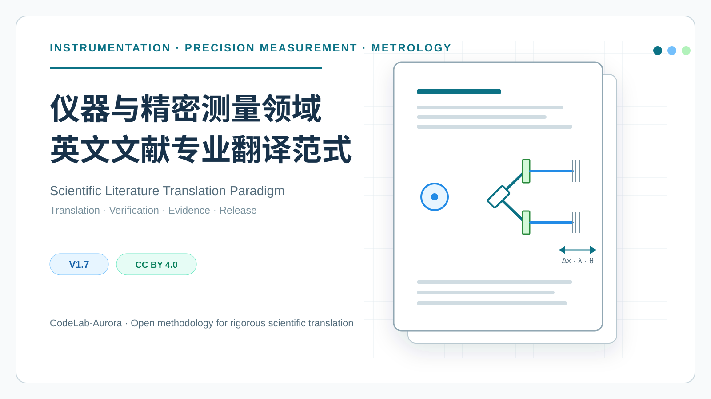
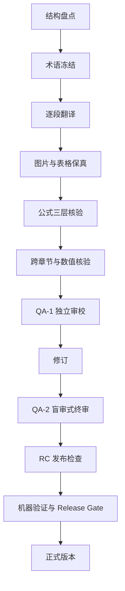

# 仪器与精密测量领域英文文献专业翻译范式

> A professional translation, verification, and PDF-delivery workflow for scientific literature in instrumentation and precision measurement.

这是一套面向仪器科学、精密测量、计量学、光学工程和光电检测等方向的英文科技文献专业翻译范式。它围绕 ChatGPT 辅助工作流，强调术语冻结、图表与公式保真、跨章节核验、可复算评分和发布前质量闸门。

当前指南版本为 **V1.8**。本版新增证据优先执行协议、阶段状态机、机器可验证检查和统一 Release Gate，要求所有“已完成”与“已通过”声明都有可定位的检查记录支持。

## 适用领域

- 仪器科学与精密测量
- 计量学与测量不确定度
- 光学工程、激光与光栅干涉
- 光电检测、位移测量与信号处理
- 机械误差与多自由度测量

## 核心特点

- 以英文原始 PDF 为最高权威来源，不让旧译文或 OCR 覆盖原文事实。
- 对术语、变量、公式、图内参数和原始表格建立可追溯核验记录。
- 图片与表格采用原始 PDF 图像保真策略，避免重绘、重排和数据漂移。
- 使用 QA-1、QA-2 和 RC 阶段隔离内部审校与正式版本。
- 对最终 PDF 的存在性、可打开性、页数、逐页渲染、元数据、实际文件名和文件一致性执行机器验证。
- 以问题清单、逐项扣分和硬门槛约束“先打高分、后补理由”的虚假评分。

## 工作流

## 案例展示

本仓库提供一个完整的中英文版式与质量核验案例，展示题名与摘要、公式、光路图、实验数据、译校注、附录及参考文献的处理效果。

- [查看七图完整案例](./examples/near-common-optical-path-two-axis-surface-encoder/README.md)
- 案例只用于展示翻译、排版和 QA 方法，不提供或替代原论文 PDF。
- 案例中的第三方论文内容不适用本仓库的 CC BY 4.0 许可，具体见[第三方内容声明](./THIRD_PARTY_NOTICES.md)。

## 阅读与下载

- [在线阅读全文](./guide/仪器与精密测量领域英文文献专业翻译范式.md)
- [查看七图翻译案例](./examples/near-common-optical-path-two-axis-surface-encoder/README.md)
- [从 Releases 下载最新版 Markdown 文件](https://github.com/CodeLab-Aurora/precision-measurement-translation-guide/releases/latest)
- [查看版本变更记录](./CHANGELOG.md)
- [查看第三方内容声明](./THIRD_PARTY_NOTICES.md)

GitHub 会自动为每个 Release 提供源码 ZIP 和 TAR.GZ。需要关注更新时，可以在仓库页面选择 **Watch → Custom → Releases**。

## 使用方式

1. 阅读指南中的输入文件、术语冻结、正文翻译、图表和公式处理规则。
2. 根据任务阶段使用文末的主提示词、续译提示词、终稿审校提示词或修订提示词。
3. 始终保留英文原始 PDF，并对技术结论、数值、公式和图表进行人工复核。
4. 只有机器验证与 Release Gate 全部通过后，才生成并发布正式版本。

## 更新约定

- 小型文字修正通过普通提交保留历史。
- 正式内容升级同步更新指南版本号与 `CHANGELOG.md`，并创建新的 Git 标签和 Release。
- 不覆盖旧版本，不强制重写公开历史。

## 许可

除另有说明外，本仓库中的原创文档与原创配图采用 [Creative Commons Attribution 4.0 International](./LICENSE) 许可。转载、改编和再分发时，请保留作者标识 `CodeLab-Aurora`、原始仓库链接、许可证链接，并说明是否做过修改。

案例截图中的论文页面、图表、出版版式和产品界面属于第三方内容，**不纳入本仓库的 CC BY 4.0 授权范围**。其使用条件、署名和限制以[第三方内容声明](./THIRD_PARTY_NOTICES.md)为准。

## 免责声明

本项目提供的是翻译与质量控制方法，不构成对任何具体译文准确性、出版合规性或学术适用性的保证。使用者应自行核对原文，并遵守所在机构、期刊、出版社及适用法律关于版权、研究诚信和 AI 辅助工具披露的要求。

本项目为独立的社区文档，与 OpenAI 不存在隶属、合作或官方背书关系。文中涉及的产品和商标归其各自权利人所有。

如果这套范式对你的科研阅读或翻译工作有帮助，欢迎点击右上角 **Star** 收藏。
