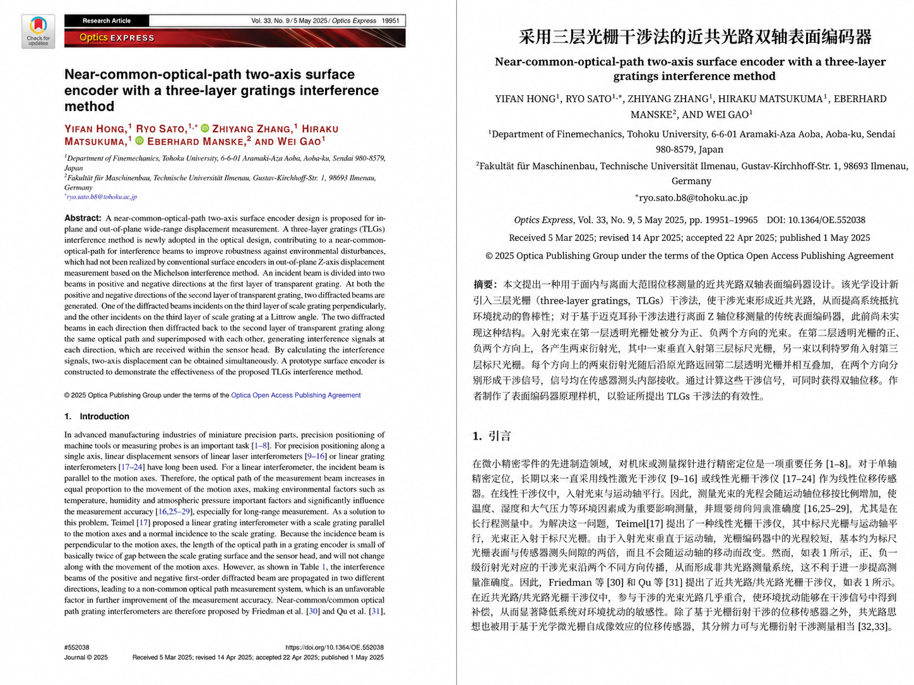
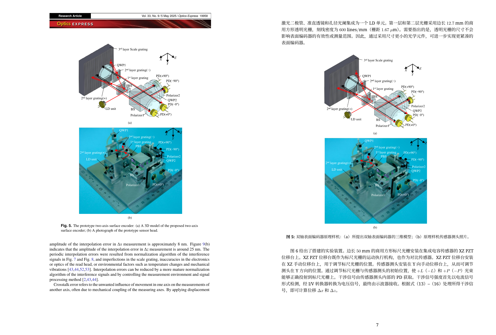
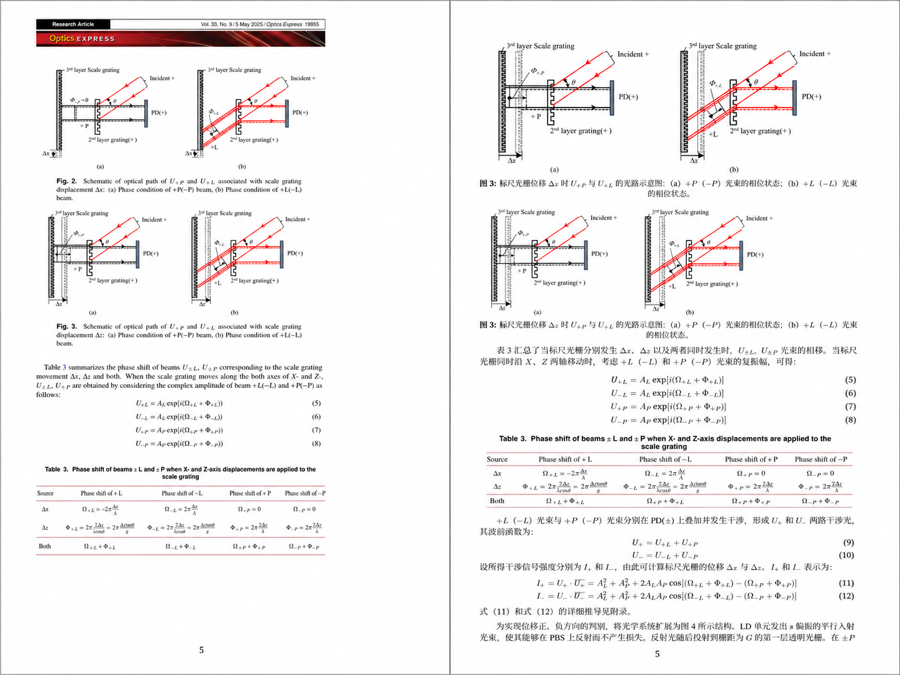
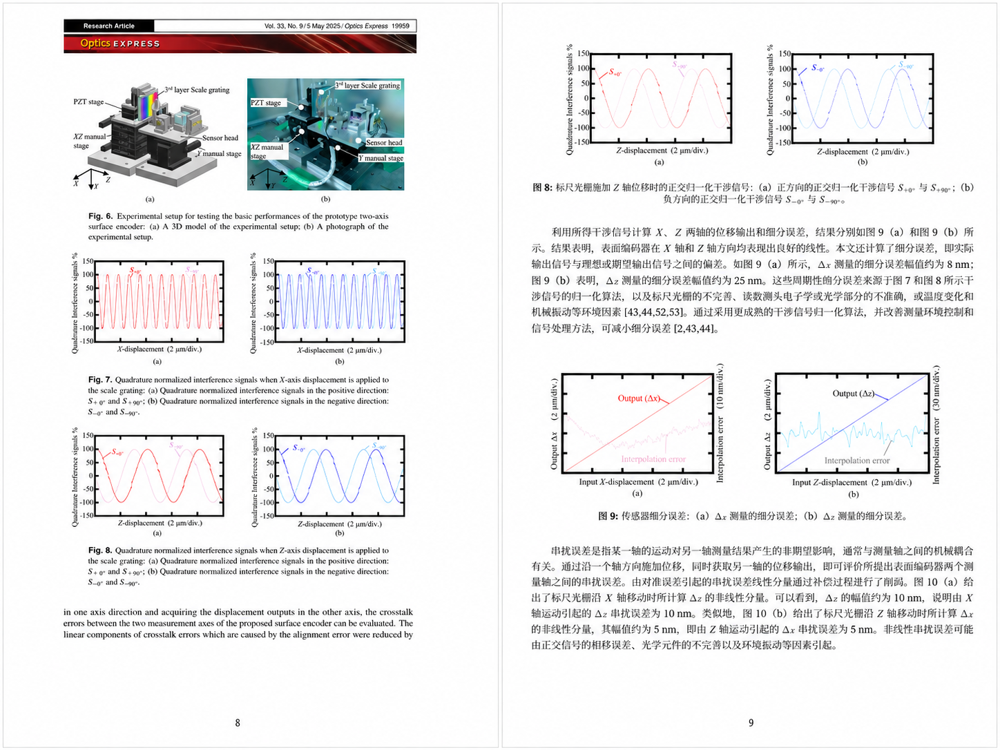
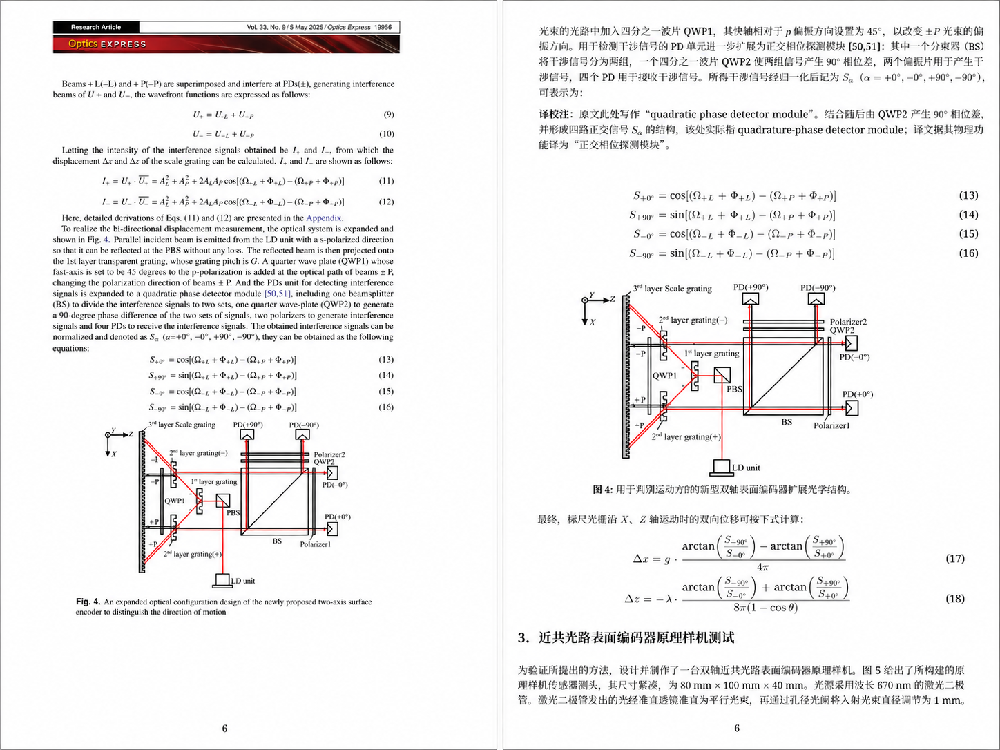
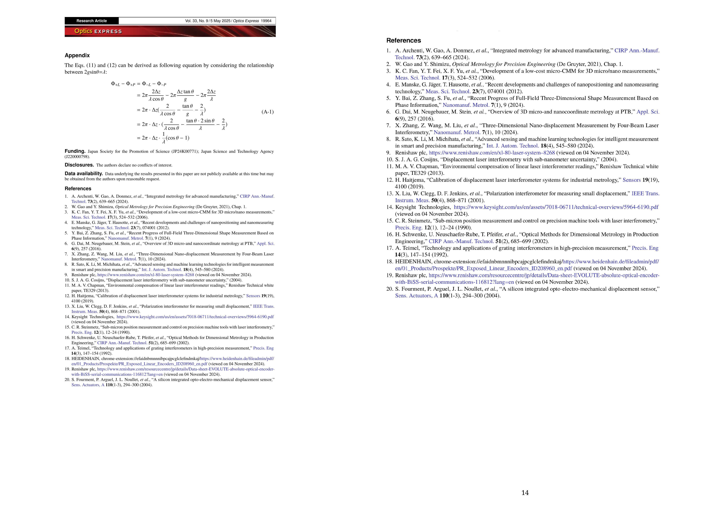

# 翻译案例：近共光路双轴表面编码器论文

> Translation case: a near-common-optical-path two-axis surface encoder using a three-layer gratings interference method.

本案例按 `0.png`—`6.png` 的顺序展示 V1.8 范式在科技论文全文翻译、原图保真、公式与表格核验、版式检查和正式发布闸门中的应用。案例仅用于说明翻译与质量控制方法，不提供原论文 PDF，也不替代对原论文的阅读和引用。

## 来源论文

Yifan Hong, Ryo Sato, Zhiyang Zhang, Hiraku Matsukuma, Eberhard Manske, and Wei Gao, “Near-common-optical-path two-axis surface encoder with a three-layer gratings interference method,” *Optics Express* **33**, 19951–19965 (2025).

- DOI：[10.1364/OE.552038](https://doi.org/10.1364/OE.552038)
- 官方页面：[Optica Publishing Group](https://opg.optica.org/oe/abstract.cfm?uri=oe-33-9-19951)

## 案例图

### 0. V1.8 执行完成与质量门槛

界面截图展示 V1.8 工作流的发布状态说明、QA 分数、问题关闭情况、文件名核验和 Release Gate 结果。截图只用于说明检查结果的呈现方式。

### 1. 题名、作者、机构和摘要对照

展示英文原始页面与中文翻译页面在题名、作者、机构、期刊信息、摘要和正文结构上的对应关系。

### 2. 原始图片、样机图与跨页正文保真

展示原始光路示意图和样机照片的保留方式，以及相关中文说明与跨页正文的版式衔接。

### 3. 公式、图示和表格保真

展示光路图、相移公式和原始英文表格在翻译版中的图像保真与编号对应。

### 4. 实验装置、信号曲线和误差结果

展示实验装置、正交信号曲线和细分误差结果在翻译版中的位置、图号与说明关系。

### 5. 公式排版、光路图与译校注

展示结构化公式、光路示意图和术语译校注在中文页面中的组合排版。

### 6. 附录、基金声明和参考文献完整性

展示附录公式、基金与数据声明、参考文献边界和跨页连续性的核验效果。

## 使用与版权说明

- `1.png`—`6.png`包含 Optica Publishing Group 出版论文的页面、图表、文字和出版版式，其使用受 Optica Open Access Publishing Agreement 及适用法律约束，仅按非商业、保留适当署名的条件在此展示。
- `0.png`包含 ChatGPT 产品界面，仅作工作流说明，不表示 OpenAI 对本仓库或案例的认可、合作或官方背书。
- 上述七张案例图均不纳入本仓库 CC BY 4.0 许可。详细边界见[第三方内容声明](../../THIRD_PARTY_NOTICES.md)。

[返回项目首页](../../README.md)
